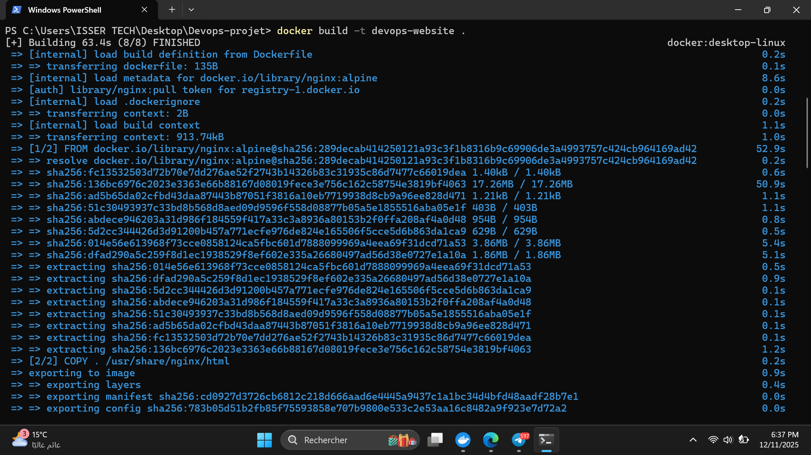
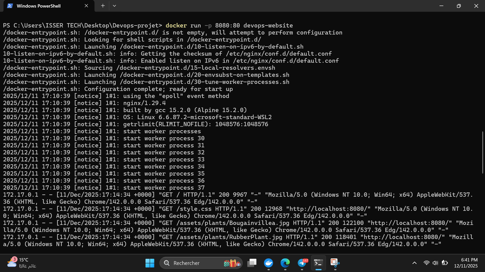
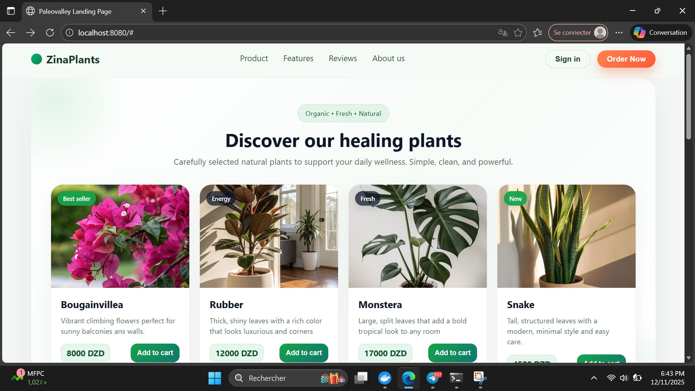
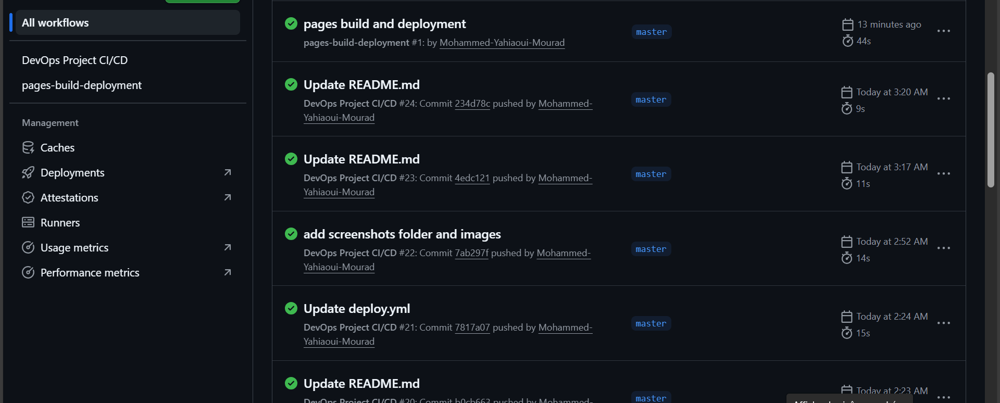
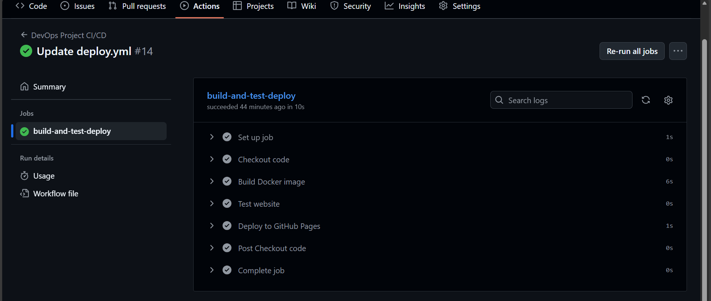
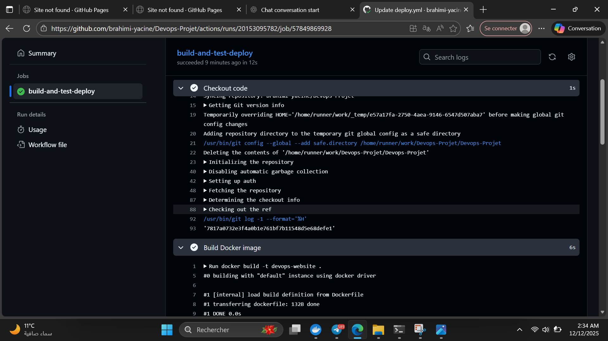
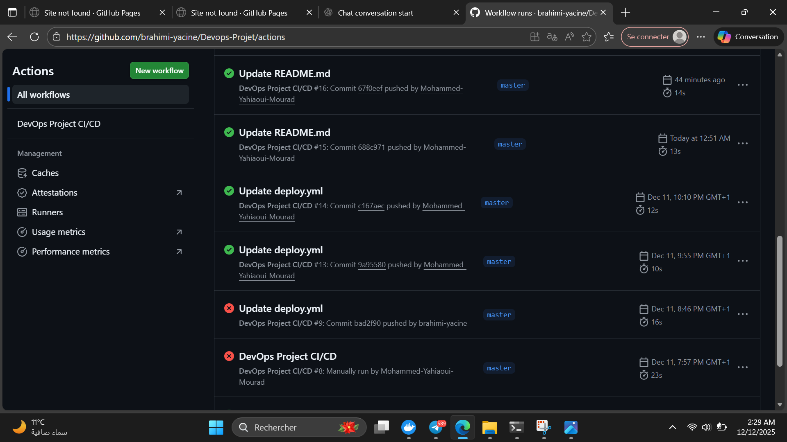
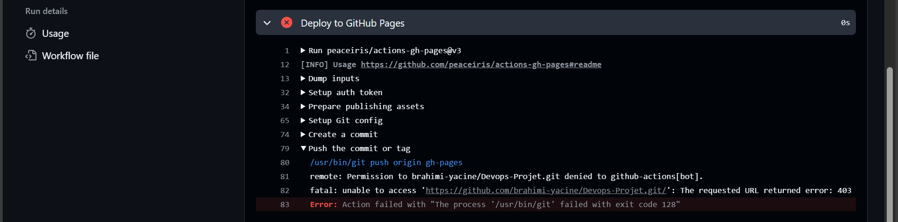
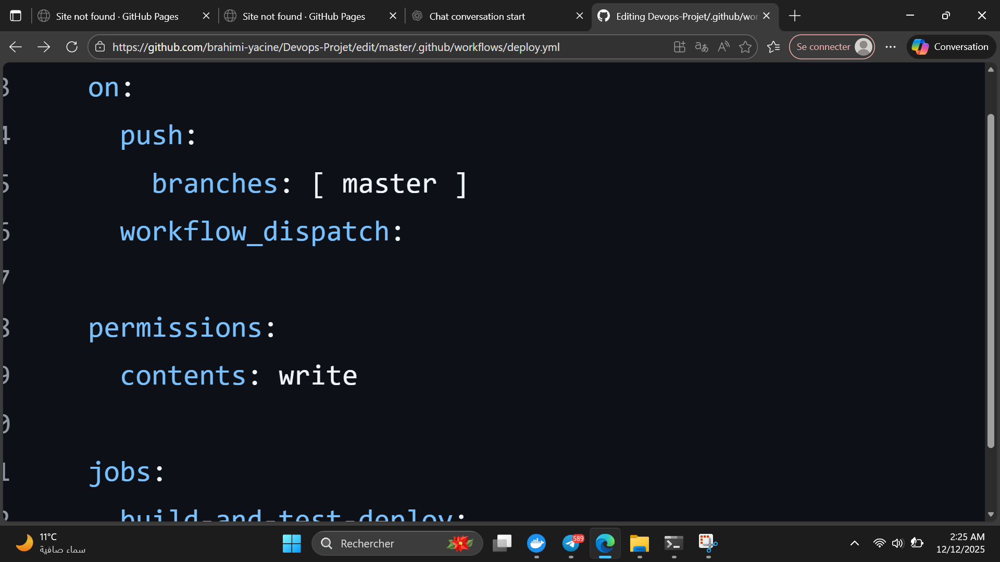

\# DevOps Project

\## Static Website with Docker and CI/CD

Méthode de travail étape par étape

# 1. Initialisation du projet

Nous avons créé un nouveau dépôt sur GitHub  pour le projet.

Nous avons ajouté les fichiers de base du site : index.html, style.css .

Nous avons organisé le dépôt de manière structurée.

# Commandes Git utilisées :
 1. Initialiser un dépôt Git local
git init

 2. Ajouter tous les fichiers au suivi Git
git add .

 3. Créer le premier commit
git commit -m "Initial commit"

 4. Renommer la branche principale en 'master'
git branch -M master

 5. Ajouter le dépôt distant GitHub
git remote add origin https://github.com/brahimi-yacine/Devops-Projet.git

 6. Envoyer la branche 'master' vers GitHub et configurer le suivi
git push -u origin master

 7. Récupérer les mises à jour du dépôt distant (avant tout push)
git pull --rebase

 8. Ajouter les nouvelles modifications
git add -A

 9. Créer un commit pour les modifications
git commit -m "update project"

 10. Pousser les commits vers GitHub
git push
---

# 2. Développement du site statique

Développement du site

Nous avons développé le site web en utilisant les fichiers et dossiers suivants :

index.html : page principale du site avec le contenu de base (titre, texte, boutons, images).

style.css : feuille de style pour styliser le site et gérer l’apparence des éléments.

header.html : section réutilisable pour l’en-tête du site.

footer.html : section réutilisable pour le pied de page (Footer) du site.

assets/plants/ : dossier contenant toutes les images (les plantes) utilisées sur le site.

Cette organisation permet un site bien structuré, facile à maintenir et à modifier.

---

# 3. Containerisation avec Docker

Nous avons écrit un fichier Dockerfile contenant les instructions pour construire l’image Docker du site :

Utilisation d’une image de base : nginx .

Copier les fichiers du site dans le répertoire du serveur à l’intérieur du conteneur.

Ouvrir le port approprié (80).

Commandes Docker pour tester localement :

 docker build -t devops-website .                    //devops-website est le nom de notre image docker
 docker run -p 8080:80 devops-website

Ainsi, nous avons vérifié que le site fonctionne correctement dans le conteneur avant le déploiement.

k

k

k

# 4. Configuration de la pipeline CI/CD

Nous avons créé le fichier .github/workflows/deploy.yml en utilisant GitHub Actions afin d’automatiser les différentes étapes du cycle DevOps.

Ce workflow s’exécute automatiquement à chaque push sur la branche master, ou manuellement grâce à l’événement workflow_dispatch.

La pipeline est divisée en 4 étapes principales et réalise les actions suivantes :

1. Récupération du code (Checkout)

GitHub Actions récupère la dernière version du code source depuis le dépôt afin de l’utiliser dans les différentes étapes de la pipeline.

2. Construction de l’image Docker (Build)

À chaque exécution de la pipeline, le fichier Dockerfile est utilisé pour construire une image Docker nommée devops-website.
Cette étape permet de s’assurer que l’application peut être correctement containerisée et exécutée dans un environnement isolé.

3. Test du site web (Test)

Cette étape consiste à lancer un conteneur Docker à partir de l’image créée, puis à vérifier le bon fonctionnement du site web à l’aide d’une requête HTTP (curl).
Si le site ne répond pas correctement, la pipeline échoue automatiquement, ce qui garantit un test réel avant le déploiement.

4. Déploiement automatique sur GitHub Pages (Deploy)

Grâce à l’action peaceiris/actions-gh-pages, le contenu du projet est automatiquement déployé dans la branche gh-pages.
Cette étape permet de mettre à jour le site web hébergé sur GitHub Pages de manière continue et automatisée après chaque modification validée.

]

-screenshot sur Actions

-screenshot sur steps

-screenshot sur logs

pour tester  GitHub Pages entrer dans  https://brahimi-yacine.github.io/Devops-Projet/
---------------------------------------------------------------------------------------------------------------------
----------------------------------------------------------------------------------------------------------------
# -Difficultés rencontrées et solutions apportées

1️ Projet privé

Problème : Le dépôt Git était en privé, donc le site ne pouvait pas être publié sur GitHub Pages.

Solution : Nous avons changé le dépôt en public pour permettre le déploiement et l’accès au site.

---

2️ Branche Main vs Master

Problème :
Le workflow GitHub Actions était configuré pour la branche main, mais le dépôt utilise master comme branche principale.
Cela causait des erreurs lors des push et empêchait le pipeline de se déclencher correctement.

Solution :
Nous avons modifié le fichier workflow .github/workflows/deploy.yml pour utiliser master comme branche principale :

permission

3️ Branche GitHub Pages (gh-pages)

Problème : Le déploiement sur GitHub Pages ne fonctionnait pas car la branche gh-pages n’était pas correctement configurée.

Solution : Nous avons créé la branche gh-pages et configuré correctement le workflow pour qu’il publie le site dessus.

---

4️ Problème avec le déploiement sur GitHub Pages

Erreur rencontrée :
Lors de la tentative de déploiement du site, le workflow CI/CD affichait une erreur (signalée en rouge) et le site n’était pas publié sur GitHub Pages.
Le problème venait du fait que les permissions d’écriture et le branche de publication n’étaient pas définis.

action erreur

logs erreur

Solution apportée :
Lors de l’ajout de la fonctionnalité GitHub Pages, nous avons modifié le fichier workflow en ajoutant :

permissions:
  contents: write
publish_branch: gh-pages

k

 

Après cette modification, le pipeline CI/CD a affiché un succès (signalé en vert) 

# Team Members:

1/Mohammed Yahiaoui Mourad

2/Brahimi Mohammed Yacine  

3/EL Fodda amr Khaled 

----------------------------------------------------------------------------------------------------

